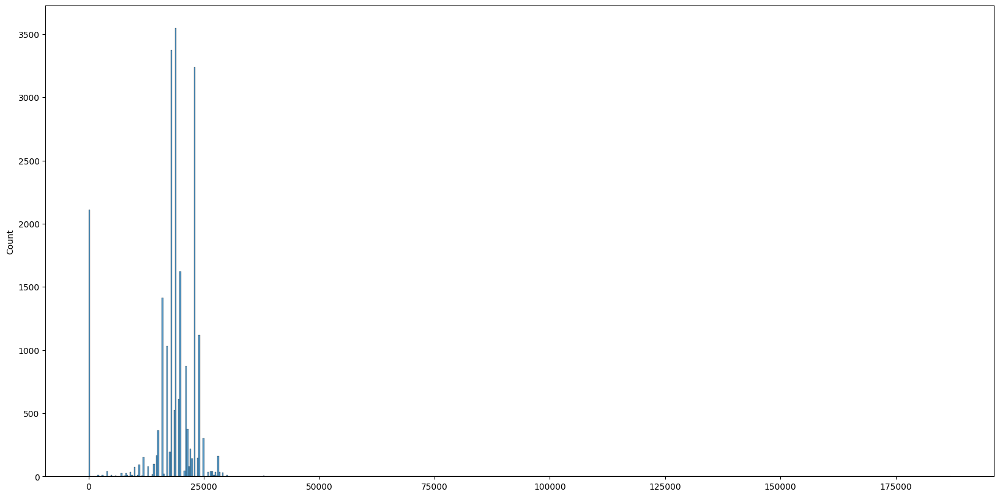

# KAKAO API

<br /><br />

## 1. 초기 세팅

<br /><br />

- 

- ㅇㅇ
```python
import requests # 외부라이브러리
from tqdm import tqdm
import time # 표준라이브러리
```


```python
!python --version
```

    Python 3.10.12


카카오 API

키워드로 장소 검색: https://developers.kakao.com/docs/latest/ko/local/dev-guide#search-by-keyword

카카오 개발자 API 키 발급: https://developers.kakao.com/
App 생성 REST API 키 복사, 붙여넣기 => 여기 가입 필요

https://developers.kakao.com/console/app 내 APP


```python
# 키워드로 장소 검색하기 (사이트 참고)
# https://developers.kakao.com/docs/latest/ko/local/dev-guide#search-by-keyword

app_key = 'KakaoAK ' + '5e344afdb788546b83962bf4c494083d'

url = 'https://dapi.kakao.com/v2/local/search/keyword.json'

# 치킨을 파는 음식점
params = {
    'query': '역',
    'category_group_code': 'SW8', # 음식점
    'page': 45
}

headers = {
    'Authorization': app_key
}

# 날리면 바로 응답이 날라와 json으로 받고 리스트에 넣는다.
res = requests.get(url, params=params, headers=headers).json()

print(res.keys())

# 딕셔너리 키로 응답이 날라왔다.
```

    dict_keys(['documents', 'meta'])


```python
import json

file_path = 'data.json'

with open(file_path, 'w') as json_file:
    json.dump(res, json_file, indent=4)

print(f"JSON 파일이 {file_path}에 저장되었습니다.")
```

    JSON 파일이 data.json에 저장되었습니다.


```python
search_count = res['meta']['total_count']

print(search_count)
```

    1085


반환된 딕셔너리에서 documents를 찍어본다.


```python
res['documents']
```


    [{'address_name': '서울 중구 충무로2가 109-2',
      'category_group_code': 'SW8',
      'category_group_name': '지하철역',
      'category_name': '교통,수송 > 지하철,전철 > 수도권4호선',
      'distance': '',
      'id': '21160648',
      'phone': '02-6110-4241',
      'place_name': '명동역 4호선',
      'place_url': 'http://place.map.kakao.com/21160648',
      'road_address_name': '서울 중구 퇴계로 지하 126',
      'x': '126.98640235001736',
      'y': '37.56096526943837'},
     {'address_name': '서울 영등포구 당산동6가 323-1',
      'category_group_code': 'SW8',
      'category_group_name': '지하철역',
      'category_name': '교통,수송 > 지하철,전철 > 수도권2호선',
      'distance': '',
      'id': '21160580',
      'phone': '02-6110-2371',
      'place_name': '당산역 2호선',
      'place_url': 'http://place.map.kakao.com/21160580',
      'road_address_name': '서울 영등포구 당산로 229',
      'x': '126.902611795523',
      'y': '37.5347843171332'},
     {'address_name': '서울 마포구 노고산동 31-11',
      'category_group_code': 'SW8',
      'category_group_name': '지하철역',
      'category_name': '교통,수송 > 지하철,전철 > 수도권2호선',
      'distance': '',
      'id': '21160531',
      'phone': '02-6110-2401',
      'place_name': '신촌역 2호선',
      'place_url': 'http://place.map.kakao.com/21160531',
      'road_address_name': '서울 마포구 신촌로 지하 90',
      'x': '126.93698075993808',
      'y': '37.555198169366435'},
     {'address_name': '서울 종로구 명륜4가 96-5',
      'category_group_code': 'SW8',
      'category_group_name': '지하철역',
      'category_name': '교통,수송 > 지하철,전철 > 수도권4호선',
      'distance': '',
      'id': '21160556',
      'phone': '02-6110-4201',
      'place_name': '혜화역 4호선',
      'place_url': 'http://place.map.kakao.com/21160556',
      'road_address_name': '서울 종로구 대학로 지하 120',
      'x': '127.00194500977393',
      'y': '37.58204391787134'},
     {'address_name': '서울 용산구 이태원동 119-23',
      'category_group_code': 'SW8',
      'category_group_name': '지하철역',
      'category_name': '교통,수송 > 지하철,전철 > 수도권6호선',
      'distance': '',
      'id': '21160762',
      'phone': '02-6311-6301',
      'place_name': '이태원역 6호선',
      'place_url': 'http://place.map.kakao.com/21160762',
      'road_address_name': '서울 용산구 이태원로 지하 177',
      'x': '126.994333861918',
      'y': '37.5345252050511'},
     {'address_name': '경기 화성시 진안동 824-1',
      'category_group_code': 'SW8',
      'category_group_name': '지하철역',
      'category_name': '교통,수송 > 지하철,전철 > 수도권1호선',
      'distance': '',
      'id': '7896218',
      'phone': '031-234-7788',
      'place_name': '병점역 1호선',
      'place_url': 'http://place.map.kakao.com/7896218',
      'road_address_name': '경기 화성시 떡전골로 97',
      'x': '127.03320037309325',
      'y': '37.206752699495524'},
     {'address_name': '서울 종로구 창신동 492-1',
      'category_group_code': 'SW8',
      'category_group_name': '지하철역',
      'category_name': '교통,수송 > 지하철,전철 > 수도권1호선',
      'distance': '',
      'id': '21160565',
      'phone': '02-6110-1281',
      'place_name': '동대문역 1호선',
      'place_url': 'http://place.map.kakao.com/21160565',
      'road_address_name': '서울 종로구 종로 지하 302',
      'x': '127.01063381083677',
      'y': '37.571669405802616'},
     {'address_name': '경기 부천시 소사구 송내동 632-4',
      'category_group_code': 'SW8',
      'category_group_name': '지하철역',
      'category_name': '교통,수송 > 지하철,전철 > 수도권1호선',
      'distance': '',
      'id': '21160606',
      'phone': '032-662-7788',
      'place_name': '송내역 1호선',
      'place_url': 'http://place.map.kakao.com/21160606',
      'road_address_name': '경기 부천시 소사구 송내대로 43',
      'x': '126.75315944764172',
      'y': '37.48764140324914'},
     {'address_name': '서울 영등포구 여의도동 2-6',
      'category_group_code': 'SW8',
      'category_group_name': '지하철역',
      'category_name': '교통,수송 > 지하철,전철 > 수도권9호선',
      'distance': '',
      'id': '10652921',
      'phone': '02-2656-0915',
      'place_name': '여의도역 9호선',
      'place_url': 'http://place.map.kakao.com/10652921',
      'road_address_name': '서울 영등포구 의사당대로 지하 101',
      'x': '126.92466104293',
      'y': '37.5211700890445'},
     {'address_name': '서울 서초구 서초동 1366-9',
      'category_group_code': 'SW8',
      'category_group_name': '지하철역',
      'category_name': '교통,수송 > 지하철,전철 > 수도권3호선',
      'distance': '',
      'id': '21160815',
      'phone': '02-6110-3421',
      'place_name': '양재역 3호선',
      'place_url': 'http://place.map.kakao.com/21160815',
      'road_address_name': '서울 서초구 남부순환로 지하 2585',
      'x': '127.03416413380752',
      'y': '37.48457681195669'},
     {'address_name': '경기 군포시 금정동 613',
      'category_group_code': 'SW8',
      'category_group_name': '지하철역',
      'category_name': '교통,수송 > 지하철,전철 > 수도권4호선',
      'distance': '',
      'id': '21160678',
      'phone': '1544-7788',
      'place_name': '금정역 4호선',
      'place_url': 'http://place.map.kakao.com/21160678',
      'road_address_name': '경기 군포시 군포로 750',
      'x': '126.94347315682283',
      'y': '37.37246820714397'},
     {'address_name': '서울 서초구 서초동 1748-4',
      'category_group_code': 'SW8',
      'category_group_name': '지하철역',
      'category_name': '교통,수송 > 지하철,전철 > 수도권3호선',
      'distance': '',
      'id': '21160636',
      'phone': '02-6110-3401',
      'place_name': '교대역 3호선',
      'place_url': 'http://place.map.kakao.com/21160636',
      'road_address_name': '서울 서초구 서초대로 지하 294',
      'x': '127.013867969161',
      'y': '37.4927431676548'},
     {'address_name': '경기 안산시 단원구 원시동 803',
      'category_group_code': 'SW8',
      'category_group_name': '지하철역',
      'category_name': '교통,수송 > 지하철,전철 > 서해선',
      'distance': '',
      'id': '472508899',
      'phone': '031-5183-2811',
      'place_name': '원시역 서해선',
      'place_url': 'http://place.map.kakao.com/472508899',
      'road_address_name': '경기 안산시 단원구 산단로 지하 70',
      'x': '126.786793532374',
      'y': '37.3026237626179'},
     {'address_name': '서울 강동구 천호동 455',
      'category_group_code': 'SW8',
      'category_group_name': '지하철역',
      'category_name': '교통,수송 > 지하철,전철 > 수도권5호선',
      'distance': '',
      'id': '8099936',
      'phone': '02-6311-5471',
      'place_name': '천호역 5호선',
      'place_url': 'http://place.map.kakao.com/8099936',
      'road_address_name': '서울 강동구 천호대로 지하 997',
      'x': '127.12392845044',
      'y': '37.5385112120297'},
     {'address_name': '인천 서구 석남동 609',
      'category_group_code': 'SW8',
      'category_group_name': '지하철역',
      'category_name': '교통,수송 > 지하철,전철 > 수도권7호선',
      'distance': '',
      'id': '183850300',
      'phone': '',
      'place_name': '석남역 7호선',
      'place_url': 'http://place.map.kakao.com/183850300',
      'road_address_name': '인천 서구 길주로 지하 120',
      'x': '126.676149271119',
      'y': '37.5062431189861'}]


```python
res['meta']
```


    {'is_end': True,
     'pageable_count': 45,
     'same_name': {'keyword': '역', 'region': [], 'selected_region': ''},
     'total_count': 1085}


```python
# 한계 45페이지까지 값 밖에 받아올 수 없음
# 46페이지를 찍어본 결과 아래와 같이 에러가 난다.

params = {
    'query': '역',
    'page': 46
}

res = requests.get(url, params=params, headers=headers).json()

print(res)
```

    {'errorType': 'InvalidArgument', 'message': 'page is more than max'}


```python
# TinyDB : 가벼운 DB
# 외부에 있는 DB를 받으려면 시간이 오래 걸려 파일로 실습한다.

!pip install tinydb
from tinydb import TinyDB, Query

db = TinyDB('/content/drive/MyDrive/Dataset/KAKAO_API/db.json.json')
```

    Collecting tinydb
      Downloading tinydb-4.8.0-py3-none-any.whl (24 kB)
    Installing collected packages: tinydb
    Successfully installed tinydb-4.8.0


분할 검색
우리나라 지도를 위경도 0.25 단위의 작은 사각형으로 쪼개어 검색

상세페이지에서 가격 긁어오기 https://place.map.kakao.com/main/v/9847579

IP 차단 피하기 위해 5초 대기

DB 저장
place_name: 음식점 이름
menu: 메뉴 이름
price: 가격


```python
# 실행 x => 아주 오래걸림 대략 10시간
# 우리나라 지도를 아주 작은 단위로 나눠 전국에 있는 치킨집 주소를 전부 분석한다.

start_x = 126 # 126.0 - 130.0
start_y = 33 # 33.0 - 39.0

dx = 0.25
dy = 0.25

for i in tqdm(range(18)):
    for j in range(26):
        x = start_x + dx * i
        y = start_y + dy * j
        print(x, y)

        for page in range(1, 46):
            params = {
                'query': '치킨',
                'page': page,
                'rect': f'{x},{y},{x + dx},{y + dy}'
            }

            res = requests.get(url, params=params, headers=headers).json()

            if len(res['documents']) == 0:
                break

            for doc in res['documents']:
                place_name = doc['place_name']

                detail_url = f'https://place.map.kakao.com/main/v/{doc["id"]}'

                data = requests.get(detail_url, headers=headers).json()
                # 치킨 가격을 가져오려고 하여 가격만 우선 탐색
                if 'menuInfo' not in data:
                    continue

                menu_list = data['menuInfo']['menuList']

                for menu_item in menu_list:
                    price = 0
                    if 'price' in menu_item:
                        price = int(menu_item['price'].replace(',', ''))
                    # TinyDB에 음식 명, 메뉴, 가격을 집어넣는다.
                    db.insert({
                        'place_name': place_name,
                        'menu': menu_item['menu'],
                        'price': price
                    })

                time.sleep(5)

            if res['meta']['is_end']:
                break
```


```python
# db에 테이블 하나, 56216행이 출력되었다.
db
```


    <TinyDB tables=['_default'], tables_count=1, default_table_documents_count=56216, all_tables_documents_count=['_default=56216']>


```python
# 가격이 35,000원 초과하는 키워드 메뉴 검색
db.search(Query().price > 35000)
```


    [{'place_name': '돌담너머바다 판포점', 'menu': '돔베 스테이크', 'price': 39000},
     {'place_name': '마담나탈리소셜클럽', 'menu': '글렌피딕 15Y', 'price': 250000},
     {'place_name': '인판포', 'menu': '바베큐 플레이터', 'price': 60000},
     {'place_name': '인판포', 'menu': '마라소라새우', 'price': 40000},
     {'place_name': '제마닭', 'menu': '닭도리탕(대)', 'price': 36000},
     {'place_name': '제마닭', 'menu': '꽃도리탕(중)', 'price': 38000},
     {'place_name': '제마닭', 'menu': '꽃도리탕(대)', 'price': 48000},
     {'place_name': '먹고정', 'menu': '백돼지한근반', 'price': 63000},
     {'place_name': '먹고정', 'menu': '백돼지한근', 'price': 42000},
     {'place_name': '먹고정', 'menu': '흑돼지한근반', 'price': 80000},
     {'place_name': '먹고정', 'menu': '흑돼지한근', 'price': 54000},
     {'place_name': '모루쿠다', 'menu': '모루쿠다 육합', 'price': 40000},
     {'place_name': '원조장수통닭', 'menu': '토종닭', 'price': 60000},
     {'place_name': '원조장수통닭', 'menu': '오리주물럭', 'price': 60000},
     {'place_name': '진솔통닭', 'menu': '토종닭(1마리)', 'price': 60000},
     {'place_name': '진솔통닭', 'menu': '오리(1마리)', 'price': 60000},
     {'place_name': '오름지미정원', 'menu': '찹스테이크 (320g)', 'price': 36000},
     {'place_name': '홍대감더덕토종닭', 'menu': '누룽지더덕토종닭', 'price': 60000},
     {'place_name': '화덕에꾸운닭 전남담양점', 'menu': '랍스터 치킨', 'price': 38000},
     {'place_name': '다사랑양념통닭', 'menu': '토종백숙', 'price': 40000},
     {'place_name': '아웃닭 신촌역점', 'menu': '오리지날 레드핀 양념치킨', 'price': 187000},
     {'place_name': '누구나홀딱반한닭 홍대점', 'menu': '바사칸치빵파티', 'price': 36900},
     {'place_name': '마녀커리크림치킨 본점', 'menu': '3-4인세트 Best3', 'price': 40000},
     {'place_name': '크치치킨 경희대점', 'menu': '치킨세트D', 'price': 37000},
     {'place_name': '누구나홀딱반한닭 선릉점', 'menu': '바사칸치빵파티', 'price': 38900},
     {'place_name': '풍미통닭', 'menu': '풍미스페셜세트', 'price': 49000},
     {'place_name': '원조꼬끼오옛날통닭', 'menu': '감자튀김', 'price': 60000},
     {'place_name': '산내돌짜장', 'menu': '매운돼지갈비찜 (큰대)', 'price': 39000},
     {'place_name': '서울치킨', 'menu': '옻닭', 'price': 40000},
     {'place_name': '평화닭갈비', 'menu': '닭볶음탕', 'price': 50000},
     {'place_name': '영자네', 'menu': '닭볶음탕(4인기준)', 'price': 47000},
     {'place_name': '우정통닭', 'menu': '산오징어', 'price': 40000},
     {'place_name': '우정통닭', 'menu': '광어사시미', 'price': 50000},
     {'place_name': '우정통닭', 'menu': '감성동사시미', 'price': 60000},
     {'place_name': '산골펜션가든', 'menu': '토종닭', 'price': 60000},
     {'place_name': '산골펜션가든', 'menu': '토종닭볶음', 'price': 60000},
     {'place_name': '화덕에꾸운닭 강원홍천점', 'menu': '랍스터 치킨', 'price': 38000},
     {'place_name': '길성이 원주점', 'menu': '누룽지 닭 백숙', 'price': 40000},
     {'place_name': '길성이 원주점', 'menu': '누룽지 오리 백숙', 'price': 50000},
     {'place_name': '길성이 원주점', 'menu': '오리주물럭(대)', 'price': 50000},
     {'place_name': '길성이 원주점', 'menu': '전복오리탕', 'price': 55000},
     {'place_name': '길성이 원주점', 'menu': '해물영계탕', 'price': 50000},
     {'place_name': '화덕에꾸운닭 창원진동점', 'menu': '랍스터 치킨', 'price': 38000},
     {'place_name': '하이네켄라운지', 'menu': 'SET1', 'price': 53000},
     {'place_name': '하이네켄라운지', 'menu': 'SET2', 'price': 50000},
     {'place_name': '하이네켄라운지', 'menu': 'SET3', 'price': 49000},
     {'place_name': '하이네켄라운지', 'menu': 'SET4', 'price': 48000},
     {'place_name': '화월통닭집', 'menu': '촌닭백숙', 'price': 40000},
     {'place_name': '앗싸마늘닭 본점', 'menu': '앗싸 스페셜 두마리 치찜세트', 'price': 37900},
     {'place_name': '안동찜닭원조', 'menu': '안동찜닭(대)', 'price': 45000},
     {'place_name': '황포식당', 'menu': '모듬조개구이(소)', 'price': 50000},
     {'place_name': '바드리산장모텔 바드리식당', 'menu': '한방백숙 촌닭', 'price': 40000},
     {'place_name': '바드리산장모텔 바드리식당', 'menu': '숙박+야외 6인평상', 'price': 50000},
     {'place_name': '바드리산장모텔 바드리식당', 'menu': '바다장어구이(국내 자연산)', 'price': 40000},
     {'place_name': '바드리산장모텔 바드리식당',
      'menu': '숙박+야외(대형)참숯바베큐세트+평상',
      'price': 70000},
     {'place_name': '바드리산장모텔 바드리식당', 'menu': '숙박+야외 참숯바베큐세트+6인평상', 'price': 60000},
     {'place_name': '산위에통나무집', 'menu': '닭백숙', 'price': 45000},
     {'place_name': '산위에통나무집', 'menu': '오리백숙', 'price': 45000},
     {'place_name': '산위에통나무집', 'menu': '옻닭', 'price': 45000},
     {'place_name': '산위에통나무집', 'menu': '엄계닭', 'price': 45000},
     {'place_name': '빅대디', 'menu': '4인세트', 'price': 44500},
     {'place_name': '영양바베큐&뭉티기', 'menu': '한우 뭉티기', 'price': 40000},
     {'place_name': '영양바베큐&뭉티기', 'menu': '양지오드레기', 'price': 40000}]


```python
# 가격이 35,000 초과 AND "치" 포함
# 두번 째 행은 187000원으로 수집에 오류가 있음을 의심할 수 있다.(이상치) => 우리는 웹에서 끌어오는게 아니라 요청하는 것이다.
# 하지만 이상치가 있더라도 카카오에서 관리하는 DB이기 때문에 공신력이 있다고 판단한다.

db.search((Query().price > 35000) & (Query().menu.search('치')))
```


    [{'place_name': '화덕에꾸운닭 전남담양점', 'menu': '랍스터 치킨', 'price': 38000},
     {'place_name': '아웃닭 신촌역점', 'menu': '오리지날 레드핀 양념치킨', 'price': 187000},
     {'place_name': '누구나홀딱반한닭 홍대점', 'menu': '바사칸치빵파티', 'price': 36900},
     {'place_name': '크치치킨 경희대점', 'menu': '치킨세트D', 'price': 37000},
     {'place_name': '누구나홀딱반한닭 선릉점', 'menu': '바사칸치빵파티', 'price': 38900},
     {'place_name': '화덕에꾸운닭 강원홍천점', 'menu': '랍스터 치킨', 'price': 38000},
     {'place_name': '화덕에꾸운닭 창원진동점', 'menu': '랍스터 치킨', 'price': 38000},
     {'place_name': '앗싸마늘닭 본점', 'menu': '앗싸 스페셜 두마리 치찜세트', 'price': 37900}]


```python
# 전국 치킨 평균 가격(프랜차이즈를 모두 포함하여 정확한 가격은 아님)

chickens = db.search(Query().menu.search('치'))

prices = []

for chicken in chickens:
    prices.append(chicken['price'])

avg_price = sum(prices) / len(prices)

print('치킨 %d개의 평균 가격은 %.2f원 입니다' % (len(chickens), avg_price))
```

    치킨 22673개의 평균 가격은 17762.06원 입니다


```python
# 가격 분포 그래프
import seaborn as sns
import matplotlib.pyplot as plt

fig, ax = plt.subplots(figsize=(20, 10))
sns.histplot(x=prices, ax=ax)
```


    <Axes: ylabel='Count'>


​    

​    

